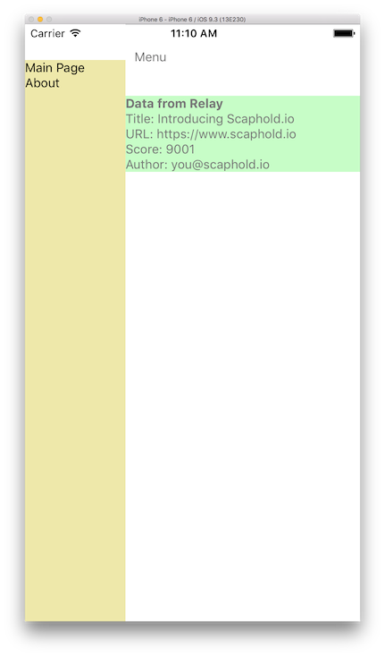

React Native working with RNRF, drawer and relay

This template allows Relay to work with react-native-drawer, bypassing babel issues. Also included react-native-router-flux for easier routing.

Change `App/Navigation/publicURL.js` for the GraphQL endpoint

`npm run reload` to update GraphQL schema from server
